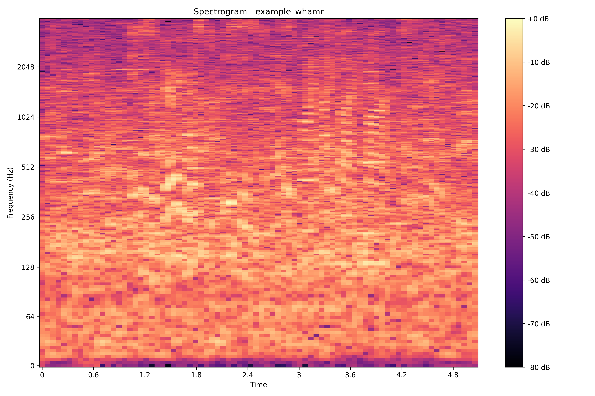
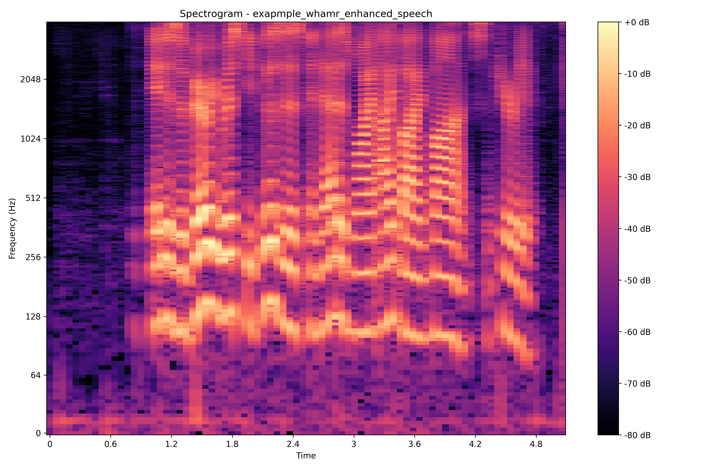

# Speech Enhancement from Noise Filtration

[Click here for more in-depth explanations on Methodology](https://sites.google.com/umich.edu/eecs-351noisefiltering/methods)




## 🔍 Features
- Noise removal from speech recordings
- Spectrogram visualization for audio analysis


## 📁 Project Structure
```
├── requirements.txt                         # dependencies for set up
├── virtual_env.sh                           # shell script for using virtual environment for dev
├── create_spectrograms_from_wav.ipynb       # notebook to visualize audio
├── noisyspeech_synthesizer.cfg              # config file for syn_noisy
├── noisyspeech_synthesizer.py               # backbone for the synthesizer
├── plot_syn_noisy_time.py                   # code for plotting time-domain visualization
├── syn_noisy/                               # example of customized synthesized noise   
├── whamr/                                   # intrusive noisy speech examples
├── frontend/                                # htmls for model code embeddings
└── audio/                                   # more wav files to play with from MS-SNSD
```

## ⚙️ Setup

#### 1. Clone the repository
```bash
git clone https://github.com/OGaCu/speech-enhancement.git
```

#### 2. Install dependencies
Ensure Python is installed, then run:
```bash
pip install -r requirements.txt
```

## 🧪 Notes
- 

## 🛠️ Troubleshooting
- **No wav files found**: Make sure they exist under `audio` with the correct names.

## 📄 License
MIT License – feel free to use, modify, and share.

## 🙌 Acknowledgements
- 